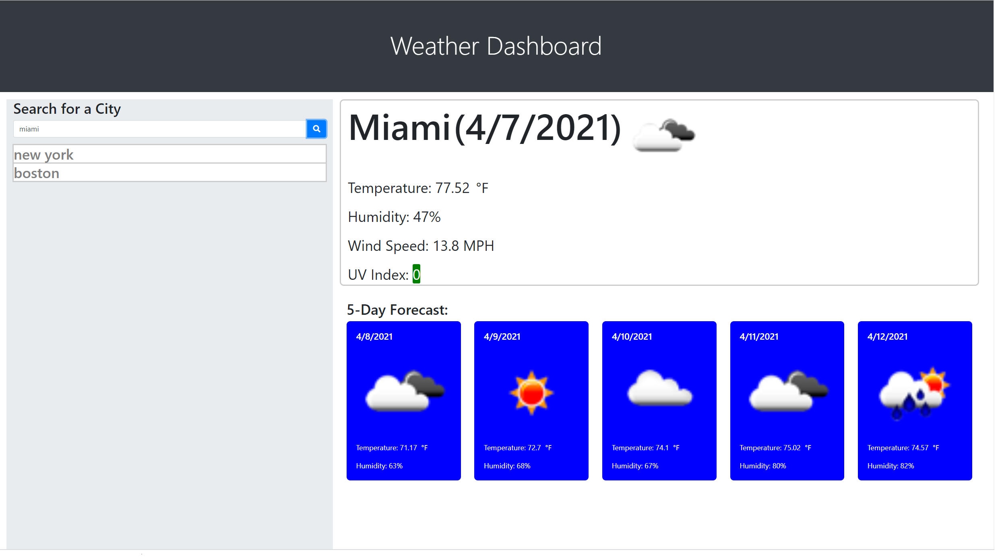
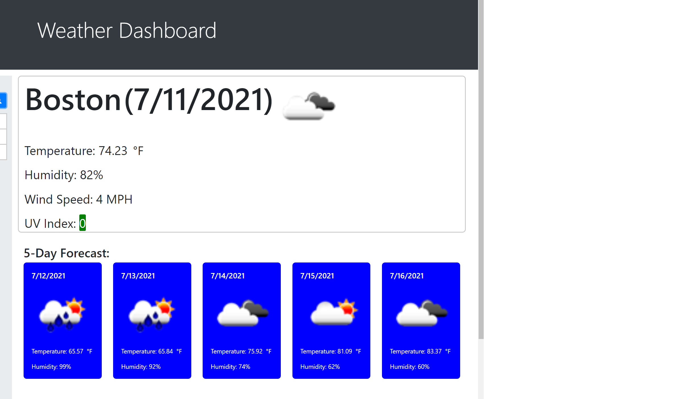

# weather-dashboard
# 06 server-side - Weather Dashboard

The weather dashboard weather is a website that helps travelers see the weather outlook for multiple cities. The site dynamically provides weather for the current day and the forecasted five days and gives travelers advanced notice of weather conditions so that they can plan accordingly. The weather dashboard runs in the browser and features dynamically updated HTML and CSS. 

## Installation

There are no specific installation instructions. However, below is minor usage instructions. 
1) Enter a city and then click the blue magnifying glass button 
2) Current weather for the selected city, along with its five-day forecast, will appear on the page
3) City is stored in local storage and persists on the page after page refresh.

Below is the URL to the webpage and github repository. 

Website URL: https://synag.github.io/weather-dashboard/

Github repository: https://github.com/synag/weather-dashboard

Folders and Files
- ReadMe: Weather Dashboard
- Index.html: Webpage
- Asset Folder (CSS folder, js folder, and image folder )

## Usage and Demo 

Minimum usage requirements. 

Below is the weekly planner screenshot, the image shows the web application's appearance and functionality:

## Credits

No additional developers worked on this project. However, I did use the following tools and resources. 

Tools: HTML, CSS, javaScript, jquery

I also used the w3school (https://www.w3schools.com/)  and [OpenWeather API](https://openweathermap.org/api) as resources.

## License

Exclusive rights to the source are granted to Carl Benbow as the developer and owner of the weather dashboard site.

